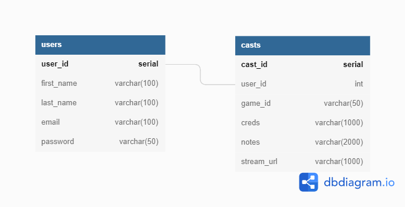

# MVP

- Create Account/Login functionality
- Logged in users are able to livecast audio for live sporting events
- Logged in users are able to listen to livecast audio of live sporting events
- Users can add specific casters to their favorites
- Landing page provides app information and promotions

## Database

- Users Table (user ID, first name, last name, email, password, favorites)
- Casts Table (game ID, user ID, creds, notes, stream URL)

## Requirements to be satisfied

#### Database

- Has at least 2 tables
- Tables contain data
- Connects to server

#### Server

- Handles requests
- Sends responses

#### Front-End

- Has 3-5 interactive features
- Communicates with server
- Has at least 5 components
- Stores values on state
- Uses values from state to display information and/or make requests
- Uses props to pass data and/or methods
- includes custom styling
